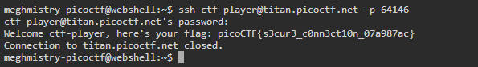

# Super SSH

Hint 1: https://linux.die.net/man/1/ssh&#x20;

Hint 2: You can try logging in 'as' someone with @titan.picoctf.net&#x20;

Hint 3:How could you specify the port?&#x20;

Hint 4: Remember, passwords are hidden when typed

Simply just use an ssh command to SSH into the server and it will print the flag for you:

<figure><figcaption>
SSHing into the ser
</figcaption></figure>

**Flag:** picoCTF{s3cur3\_c0nn3ct10n\_07a987ac}
